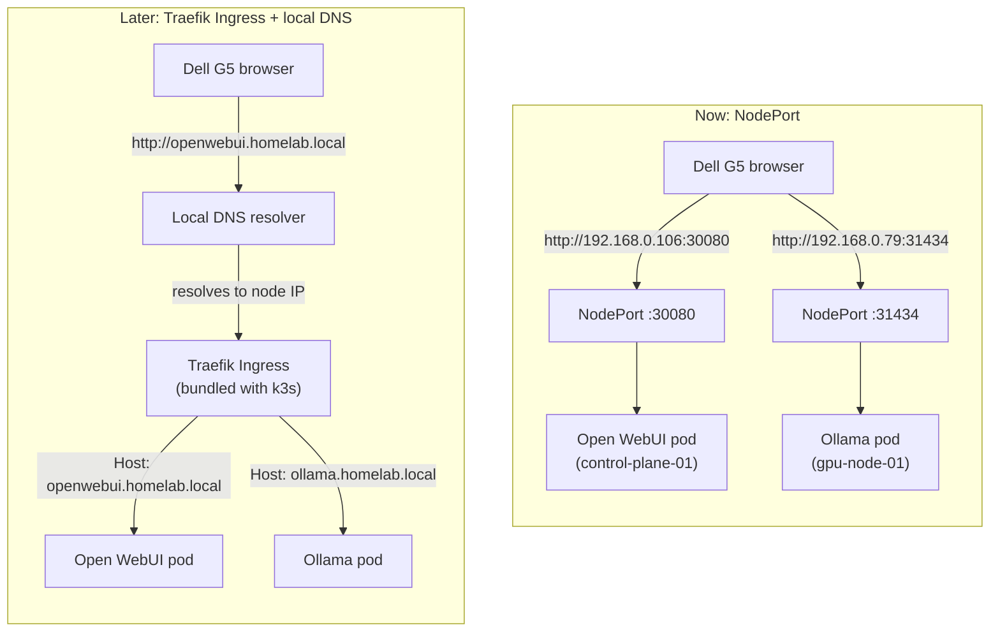

# ADR 0009: Expose Apps via NodePort Now, Migrate to Traefik Ingress + Local DNS Later

**Status:** Accepted
**Date:** 2026-08-19
**Related to:** [ADR 0007](0007-flannel-then-cilium.md) (also a "get it working simply first, upgrade the networking layer later" sequencing decision)

## Context

Ollama and Open WebUI need to be reachable from browsers/tools on the home LAN (192.168.0.x) — specifically the Dell G5 jump box, but potentially other LAN devices later. The cluster nodes (`control-plane-01`, `gpu-node-01`) sit on that same LAN with static IPs. k3s ships Traefik as a bundled ingress controller (exposed via its own `ServiceLB`/klipper load balancer on the host's IP), so an Ingress-based path is available without installing anything extra — but it needs a hostname to route on, and there's no internal DNS yet to resolve one.

Two viable exposure paths exist today:

1. **`NodePort` Services** — Kubernetes exposes the app's port directly on every node's IP (e.g. `http://192.168.0.106:30080`), no hostname or DNS required.
2. **Traefik `Ingress` + local DNS** — route by hostname (e.g. `http://openwebui.homelab.local`) through the existing Traefik controller, requiring either a `/etc/hosts` entry per client or a real internal DNS resolver (e.g. `dnsmasq`, Pi-hole, or a k3s-adjacent CoreDNS forward zone) so hostnames resolve on the LAN.

## Decision

Start with `NodePort` Services for Ollama and Open WebUI. Migrate to Traefik `Ingress` with local DNS once more than one or two apps need LAN exposure and per-port URLs stop being manageable.

## Rationale

- `NodePort` requires zero additional infrastructure — it works the moment the Service is applied, which matches the project's incremental approach (ADR 0004): get a working baseline first, add the "proper" version once it's actually needed.
- Local DNS is a real piece of infrastructure to stand up and maintain (a resolver, records, and either DHCP-pushed DNS or per-device config) — worth doing once, not worth blocking the first working Ollama + Open WebUI deployment on.
- `NodePort`'s downside — one port per app, URLs like `:30080` instead of clean hostnames — is a real papercut but not a blocker at 1–2 exposed apps. It becomes a real problem once n8n, agent orchestration UIs, and other apps in the "On the horizon" list all want LAN access.
- Traefik is already running in the cluster (bundled with k3s) — the Ingress migration later is a routing-layer change, not a new component to install.

## Options compared

## Consequences

- Ollama and Open WebUI Services are `type: NodePort` (see `infra/k8s/base/ollama-openwebui/`). Their NodePort numbers (30080, 31434) are fixed choices documented there — changing them means updating any bookmarks/scripts pointing at them.
- No DNS work is required to reach either app today: `http://<any-node-ip>:<nodeport>` works from any device on the LAN, not just the Dell G5.
- When the Ingress migration happens, `NodePort` Services can either be kept (dual access) or converted to `ClusterIP` once Ingress is the only intended path — that's a decision for that future ADR, not this one.
- Standing up local DNS (resolver choice, record management, how clients pick it up) is its own follow-up decision, not addressed here.

## Follow-ups

- [ ] Deploy Ollama + Open WebUI behind NodePort (this ADR's immediate scope)
- [ ] Decide on a local DNS approach (dnsmasq / Pi-hole / CoreDNS forward zone) — future ADR
- [ ] Migrate Ollama + Open WebUI (and future apps) to Traefik Ingress with hostnames once local DNS exists
- [ ] Decide whether NodePort Services are kept alongside Ingress or retired at that point
