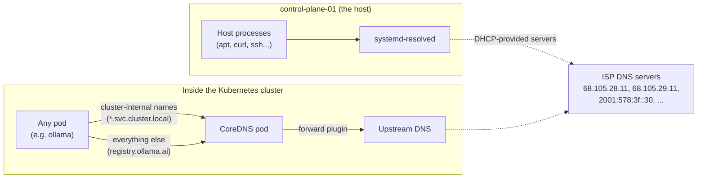

# ADR 0010: Pin CoreDNS's Upstream DNS (Incident Writeup)

**Status:** Accepted
**Date:** 2026-08-19
**Related to:** [ADR 0007](0007-flannel-then-cilium.md) (networking), [ADR 0008](0008-nvidia-device-plugin-default-runtime.md) (another "incident writeup" ADR — same format)

This one is written as a teaching doc, not just a decision record — the failure touched several Kubernetes networking concepts at once (pod DNS, CoreDNS, kubelet's role in pod setup) that are worth actually understanding rather than just patching around. If you already know how Kubernetes DNS works, skip to **Decision**.

## Background: how a pod resolves a hostname

When a container runs `ollama pull gemma3:4b`, it needs to turn `registry.ollama.ai` into an IP address. That's DNS resolution, and inside Kubernetes it doesn't work quite the way it does on a normal Linux machine:

- Every Linux process resolves hostnames by reading `/etc/resolv.conf`, which lists one or more **nameservers** (DNS servers) to ask.
- On a normal machine, that file is managed by the OS (here, `systemd-resolved`) and usually points at your router or ISP's DNS servers.
- Inside a **pod**, `/etc/resolv.conf` is a *different, pod-local file* — it's not the host's. **`kubelet`** (the agent that manages containers on a node) writes it into the pod at the moment the pod is created, and by default points it at **CoreDNS**.
- **CoreDNS** is the DNS server that ships with every standard Kubernetes cluster (including k3s). It runs as an ordinary pod (`coredns-...` in the `kube-system` namespace) and does two jobs: answer cluster-internal names (like `ollama.ollama.svc.cluster.local`, which is how Open WebUI finds Ollama) and **forward** anything else — like `registry.ollama.ai` — to a real upstream DNS server out on the internet.
- Which upstream server CoreDNS forwards to is controlled by its own config file (the **Corefile**, stored in a Kubernetes `ConfigMap`), which in k3s's default setup literally says `forward . /etc/resolv.conf` — meaning "forward to whatever's in *my own* `/etc/resolv.conf`." Which loops back to the same kubelet-populated-at-creation-time file described above, just for the CoreDNS pod itself.

So there are actually two independent DNS paths in play, and they don't automatically agree:

## What actually broke

`control-plane-01` is on Wi-Fi via a USB adapter, and its DHCP lease handed it **four** DNS servers: two IPv4 (`68.105.28.11`, `68.105.29.11`) and two IPv6 (`2001:578:3f::30`, `2001:578:3f:1::30`).

- Linux's standard `resolv.conf` format can only hold **3** nameserver lines (a decades-old glibc limit) — k3s's own logs showed this exact warning: `"Nameserver limits exceeded... some nameservers have been omitted"`. It kept the first 3, which included one of the IPv6 addresses.
- That IPv6 address had **no real working route** on this network (common with ISPs that advertise IPv6 DNS but don't fully support it end-to-end).
- **The host itself was fine** — `systemd-resolved` is smart about failing over between multiple servers quickly, so `curl`/`apt`/SSH all worked normally on `control-plane-01`.
- **CoreDNS was not fine** — its `forward` plugin tried the broken IPv6 server and stalled on it before falling back, so every lookup for an external name (like `registry.ollama.ai`) timed out. Cluster-internal names still worked throughout, which is why NodePort access to Open WebUI worked fine while `ollama pull` failed — those are two different resolution paths, per the diagram above.

This is a good example of a class of bug that's specific to Kubernetes: **the host being healthy doesn't mean pods are healthy**, because pods get their own copy of network config, made once at pod-creation time, through a different code path than the host uses.

## Decision

Pin CoreDNS's upstream to well-known public resolvers (`1.1.1.1`, `8.8.8.8`) instead of trusting whatever the network's DHCP hands out, via k3s's `--resolv-conf` flag (set in `/etc/rancher/k3s/config.yaml`, pointing at a small static file we control).

## Why the first fix attempt didn't work

The first attempt was: write the new resolv-conf source, then `systemctl restart k3s`. That restarts the **k3s server process** (the control plane) — but CoreDNS is a regular **workload pod**, not part of that process. A workload pod's `/etc/resolv.conf` is fixed at the moment it's created; restarting k3s doesn't recreate already-running pods. The old CoreDNS pod (96 minutes old, 0 restarts) just kept using its original, broken DNS config the whole time.

The actual fix needed a second step: `kubectl rollout restart deployment/coredns -n kube-system`, which recreates the CoreDNS pod — *that's* the point at which kubelet writes the corrected `/etc/resolv.conf` into it. `infra/k8s/install-k3s-server.sh` now does both steps, in order, every time it runs.

## Consequences

- External DNS lookups from any pod (not just Ollama) now go through `1.1.1.1`/`8.8.8.8`, independent of whatever DNS the network's DHCP provides. This is a reasonable default for a homelab; revisit if there's ever a reason to prefer the ISP's resolvers specifically (there isn't currently).
- Anyone re-running `install-k3s-server.sh` on a healthy cluster gets a brief CoreDNS restart (a few seconds of DNS unavailability for anything mid-lookup) — acceptable for a homelab, worth knowing if this is ever run against a cluster with real users.
- The general lesson — pod-local config set at creation time, not live — applies beyond DNS. Any future "I changed a config and restarted the service but the pod still shows old behavior" bug is worth checking against this same pattern first.

## Follow-ups

- [x] Pin CoreDNS upstream to 1.1.1.1/8.8.8.8
- [x] Force-restart CoreDNS so the pin actually takes effect
- [x] Confirm `ollama pull` succeeds after the fix
