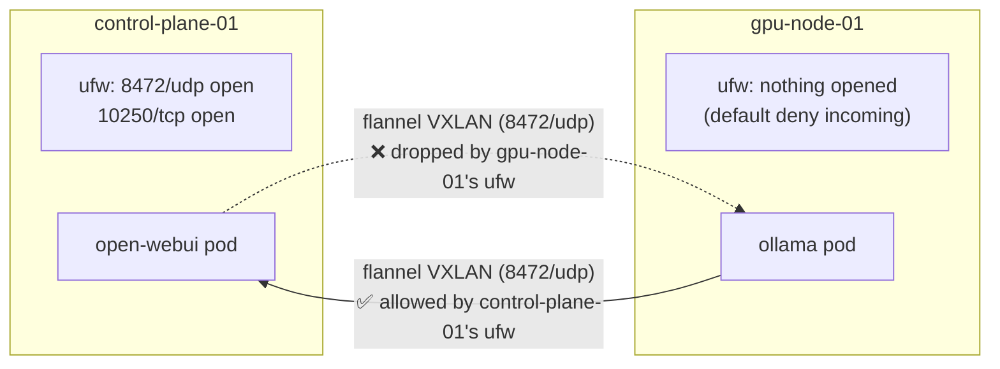

# ADR 0011: Open Cluster Firewall Ports Symmetrically on Every Node (Incident Writeup)

**Status:** Accepted
**Date:** 2026-08-19
**Related to:** [ADR 0010](0010-coredns-upstream-dns-incident.md) (another same-session networking incident — read that one first if pod networking basics are still unfamiliar)

Like ADR 0010, this is written to explain the concept, not just record the fix — the actual bug is a good example of how a firewall rule opened on only one side of a connection can look like it's working (because you tested the direction that happens to be open) while being completely broken the other way.

## Background: cluster traffic crosses node boundaries constantly

A Kubernetes Service (like `ollama` in the `ollama` namespace) doesn't care which node a pod is actually running on — any other pod, or any NodePort request landing on *any* node, can reach it. Concretely, that means real network packets travel **between** `control-plane-01` and `gpu-node-01` for:

- **Pod-to-pod / Service traffic** — carried over `flannel`'s VXLAN overlay, a tunnel encapsulating pod-network packets inside UDP packets on port `8472`, sent node-to-node over the regular LAN.
- **kubelet API calls** — the control plane talking to each node's kubelet (metrics, exec, log streaming) on TCP `10250`.
- **NodePort traffic** — kube-proxy on *whichever node received the request* forwards it to the actual pod, which might be on a different node, again over the flannel overlay.

All of this depends on `ufw` on **both** nodes allowing the relevant ports **inbound**. A firewall rule only protects the node it's configured on — opening `8472/udp` on `control-plane-01` does nothing for traffic arriving at `gpu-node-01`.

## What actually broke

`install-k3s-server.sh` opens `ufw` for `6443/tcp`, `8472/udp`, and `10250/tcp` — but it only ever runs on `control-plane-01`. `join-k3s-agent.sh`, the worker counterpart that runs on `gpu-node-01`, never touched `ufw` at all. The asymmetry:

This is exactly why the symptoms looked so confusing while debugging: **every test that happened to go `gpu-node-01 → control-plane-01` worked** (NodePort access to Open WebUI, the `getent`/DNS tests), because that direction was open. **Every test going `control-plane-01 → gpu-node-01` timed out** — the Ollama pod itself (`10.42.1.6:11434`), its ClusterIP (`10.43.247.59:11434`), and its NodePort (`31434`) all failed the same way, because they all ultimately depend on the same blocked path. The pod was healthy and working (confirmed by reaching it from `gpu-node-01` itself, same-node); the network path *to* it from anywhere else was the actual problem.

This also explains why it didn't surface immediately: Open WebUI's pod happens to run on `control-plane-01` (deliberately pinned there, see ADR 0008/0009), so nothing had tried to reach a `gpu-node-01`-hosted Service from off-node until Ollama needed to be reached directly.

## Decision

Open the same set of cluster-networking ports on **every** node, not just the control plane: `8472/udp` (flannel), `10250/tcp` (kubelet), and the full NodePort range `30000:32767/tcp` (rather than individual per-app ports — see below). `join-k3s-agent.sh` now does this, matching `install-k3s-server.sh`.

## Why the NodePort rule changed from specific ports to a range

`open-nodeport-firewall.sh` originally opened `30080/tcp` and `31434/tcp` individually — the two ports in use at the time. That doesn't scale: every future app exposed via NodePort (n8n, etc.) would mean coming back to edit that script and re-running it on every node. Kubernetes' NodePort allocator only ever picks from `30000–32767` anyway, so opening that whole range once is equivalent in practice, gives new NodePort Services network access automatically, and removes an entire category of "did I remember to open the firewall for the new port" mistakes. `open-nodeport-firewall.sh` is kept as a standalone fixer for nodes set up before this change, but both install scripts now do this as part of normal setup.

## Consequences

- Every current and future NodePort-exposed Service works from any node without further firewall changes.
- The general lesson — **a firewall rule opened on one node says nothing about any other node** — is worth checking first for any future "works from node A, times out from node B" symptom in this cluster.
- `docs/decisions/0009`'s incident note ("NodePort traffic appears to bypass ufw's filter chain via kube-proxy's DNAT") was **only ever tested same-node** (`gpu-node-01 → control-plane-01`, where `control-plane-01`'s `ufw` already had the right rules). It should not be read as "ufw doesn't matter for NodePort traffic" — this incident shows the opposite is true cross-node.

## Follow-ups

- [x] Open `8472/udp`, `10250/tcp`, and the NodePort range on `gpu-node-01`
- [x] Fold these rules into `join-k3s-agent.sh` for future nodes
- [x] Generalize NodePort firewall rules to the full range on both scripts
- [x] Confirm Ollama is now reachable from `control-plane-01` (ClusterIP and NodePort) and from the Dell G5 browser via Open WebUI — confirmed working, including a successful chat completion
